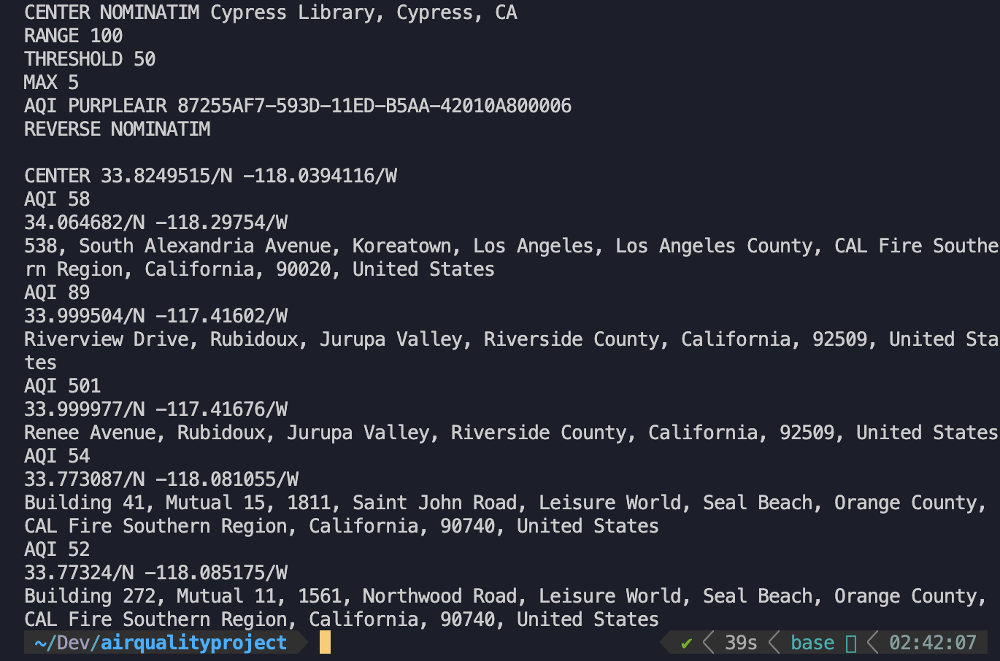

# Air Quality Filter

After a few lines of input, the program finds a specified amount of locations with an air quality index (AQI) of a certain threshold. It takes parameters such as the AQI threshold, number of locations desired, center location, and distance from the center to find valid locations with a certain AQI. Uses the PurpleAir API to get the data they have from all the sensors that are on their network. The data I received from PurpleAir was the PM2.5 pollutant and used linear interpolation to convert it to AQI. Uses Nominatim's API to forward and reverse geocode. This is used to filter results by a certain distance away from the center location. I used equirectangular approximation to calculate the distance between two points.

 
 

